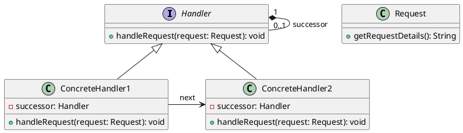

# Chain of Responsibility Pattern

## Overview

The Chain of Responsibility pattern is a behavioral design pattern that allows an object to pass a request along a chain of handlers. The request travels along the chain until a handler is found that can handle it. This pattern promotes the principle of loose coupling by separating the sender of a request from its receivers.

## Key Components

- **Handler**: An interface or abstract class defining how requests are handled or passed along the chain.
- **ConcreteHandler**: Classes that implement the Handler interface or extend an abstract Handler class, providing specific handling for requests. If a ConcreteHandler cannot handle a request, it passes it to the next handler in the chain.
- **Client**: The initiator of the request, which is sent to the first handler in the chain.

## Benefits

- **Decoupling**: The sender and receiver of a request are decoupled.
- **Flexibility**: The chain can be reorganized or assigned dynamically at runtime.
- **Responsibility Sharing**: More than one handler can be responsible for handling a request.

## When to Use

- When more than one object can handle a request, but the handler isn't known a priori. The handler should be determined automatically.
- When you want to issue a request to one of several objects without specifying the receiver explicitly.
- When the set of objects that can handle a request should be specified dynamically.

## Use Case Scenarios

1. **GUI Event Handling**: In graphical user interfaces, events like mouse clicks or keystrokes can be handled by different components based on the context, such as a button click or a menu selection.

2. **Approval Processes**: Requests for approval, such as budget requests or vacation leaves, can pass through multiple levels of management hierarchy until approved or rejected.

3. **Data Processing Pipelines**: Data might go through different processing stages, such as validation, transformation, and storage, with each stage handled by a different component.

4. **Logging and Auditing**: Different loggers can process log messages based on their level of severity (e.g., debug, info, warning, error) or their source.

5. **Authentication and Authorization**: In a security framework, requests can pass through various checks like authentication, role-based access control, and resource permissions.

## Conclusion

The Chain of Responsibility pattern offers a flexible and dynamic approach to handling requests. By decoupling the sender and receivers and allowing multiple objects a chance to handle the request, it facilitates the development of loosely coupled systems.

uml


## Example for Logging

'''csharp
public enum LogLevel
{
    DEBUG,
    INFO,
    WARNING,
    ERROR
}
public abstract class Logger
{
    protected LogLevel logLevel;
    protected Logger nextLogger;

    public Logger(LogLevel level)
    {
        this.logLevel = level;
    }

    public Logger SetNext(Logger nextLogger)
    {
        this.nextLogger = nextLogger;
        return this.nextLogger;
    }

    public void LogMessage(LogLevel level, string message)
    {
        if (this.logLevel <= level)
        {
            Write(message);
        }
        if (nextLogger != null)
        {
            nextLogger.LogMessage(level, message);
        }
    }

    protected abstract void Write(string message);
}
public class ConsoleLogger : Logger
{
    public ConsoleLogger(LogLevel level) : base(level) {}

    protected override void Write(string message)
    {
        Console.WriteLine("Standard Logger: " + message);
    }
}

public class FileLogger : Logger
{
    public FileLogger(LogLevel level) : base(level) {}

    protected override void Write(string message)
    {
        Console.WriteLine("File Logger: " + message);
    }
}

public class EmailLogger : Logger
{
    public EmailLogger(LogLevel level) : base(level) {}

    protected override void Write(string message)
    {
        Console.WriteLine("Email Logger: " + message);
    }
}
class Program
{
    static void Main(string[] args)
    {
        Logger loggerChain = GetLoggerChain();

        loggerChain.LogMessage(LogLevel.INFO, "This is an informational message.");
        loggerChain.LogMessage(LogLevel.DEBUG, "This is a debug message.");
        loggerChain.LogMessage(LogLevel.WARNING, "This is a warning message.");
        loggerChain.LogMessage(LogLevel.ERROR, "This is an error message.");
    }

    private static Logger GetLoggerChain()
    {
        Logger consoleLogger = new ConsoleLogger(LogLevel.DEBUG);
        Logger fileLogger = new FileLogger(LogLevel.INFO);
        Logger emailLogger = new EmailLogger(LogLevel.ERROR);

        //Chain: SetNext(fileLogger).SetNext(emailLogger)
        consoleLogger.SetNext(fileLogger).SetNext(emailLogger);

        return consoleLogger;
    }
}

```

## example for Authentication and Authorization

'''csharp
public class AuthenticationHandler : Handler
{
	public override bool HandleRequest(string request)
	{
		if (request == "AUTH")
		{
			Console.WriteLine("AuthenticationHandler: Authenticating the user.");
			return true;
		}
		else if (Successor != null)
		{
			return Successor.HandleRequest(request);
		}
		return false;
	}
}

public class AuthorizationHandler : Handler
{
	public override bool HandleRequest(string request)
	{
		if (request == "AUTHORIZATION")
		{
			Console.WriteLine("AuthorizationHandler: Authorizing the user.");
			return true;
		}
		else if (Successor != null)
		{
			return Successor.HandleRequest(request);
		}
		return false;
	}
}

class Program
{
	static void Main(string[] args)
	{
		Handler authenticationHandler = new AuthenticationHandler();
		Handler authorizationHandler = new AuthorizationHandler();

		authenticationHandler.SetSuccessor(authorizationHandler);

		authenticationHandler.HandleRequest("AUTH");
		authenticationHandler.HandleRequest("AUTHORIZATION");
		authenticationHandler.HandleRequest("INVALID");
	}
}
'''

## Real World Example

The Chain of Responsibility pattern is used in the .NET framework in the form of the `HttpHandler` class, which is used to process HTTP requests. The `HttpHandler` class is part of the ASP.NET pipeline and is responsible for processing HTTP requests and generating HTTP responses. The `HttpHandler` class is designed to be part of a chain, where each handler can process the request or pass it to the next handler in the chain.

## Summary

The Chain of Responsibility pattern is a powerful tool for handling requests in a flexible and dynamic way. By decoupling the sender and receivers and allowing multiple objects a chance to handle the request, it promotes the development of loosely coupled systems. This pattern is particularly useful in scenarios where the handler of a request is not known a priori and needs to be determined automatically. It is also useful when the set of objects that can handle a request should be specified dynamically. The Chain of Responsibility pattern is widely used in various domains, such as GUI event handling, approval processes, data processing pipelines, logging and auditing, and authentication and authorization. It is also used in the .NET framework in the form of the `HttpHandler` class, which is used to process HTTP requests.

## References

https://en.wikipedia.org/wiki/Chain-of-responsibility_pattern

https://www.dofactory.com/net/chain-of-responsibility-design-pattern

https://www.oodesign.com/chain-of-responsibility-pattern.html

https://www.tutorialspoint.com/design_pattern/chain_of_responsibility_pattern.htm

https://www.geeksforgeeks.org/chain-responsibility-design-pattern/

https://www.c-sharpcorner.com/UploadFile/bd8f8f/chain-of-responsibility-design-pattern-in-C-Sharp/

https://www.infoworld.com/article/2072583/chain-of-responsibility.html
    
https://www.codeproject.com/Articles/45220/Design-Patterns-Chain-of-Responsibility-Pattern

https://www.dotnettricks.com/learn/designpatterns/chain-of-responsibility-design-pattern-dotnet

c# code for HttpHandler

```csharp

public class HttpHandler
{
	private HttpHandler _successor;

	public void SetSuccessor(HttpHandler successor)
	{
		_successor = successor;
	}

	public virtual void ProcessRequest(HttpRequest request)
	{
		if (_successor != null)
		{
			_successor.ProcessRequest(request);
		}
	}
}

public class AuthenticationHandler : HttpHandler
{
	public override void ProcessRequest(HttpRequest request)
	{
		if (request.Url.AbsolutePath == "/login")
		{
			Console.WriteLine("AuthenticationHandler: Authenticating the user.");
		}
		else
		{
			base.ProcessRequest(request);
		}
	}
}

public class AuthorizationHandler : HttpHandler
{
	public override void ProcessRequest(HttpRequest request)
	{
		if (request.Url.AbsolutePath == "/admin")
		{
			Console.WriteLine("AuthorizationHandler: Authorizing the user.");
		}
		else
		{
			base.ProcessRequest(request);
		}
	}
}

class Program
{
	static void Main(string[] args)
	{
		HttpHandler authenticationHandler = new AuthenticationHandler();
		HttpHandler authorizationHandler = new AuthorizationHandler();

		authenticationHandler.SetSuccessor(authorizationHandler);

		HttpRequest request1 = new HttpRequest(new Uri("http://example.com/login"));
		HttpRequest request2 = new HttpRequest(new Uri("http://example.com/admin"));
		HttpRequest request3 = new HttpRequest(new Uri("http://example.com/home"));

		authenticationHandler.ProcessRequest(request1);
		authenticationHandler.ProcessRequest(request2);
		authenticationHandler.ProcessRequest(request3);
	}
}
```

